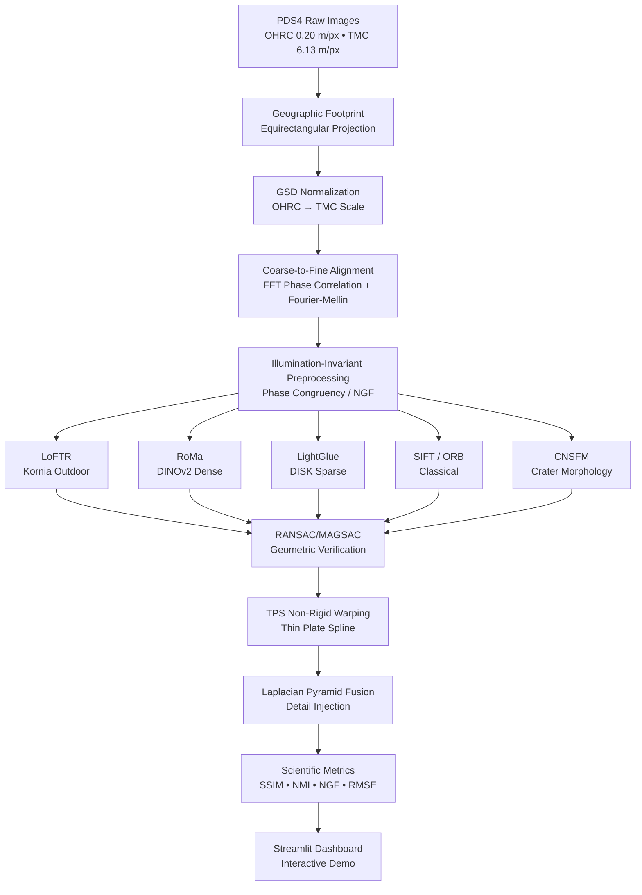

# 🌓 PixelOrbit — Chandrayaan-2 Cross-Sensor Lunar Image Registration

[](https://colab.research.google.com/github/Helium7707/PixelOrbit/blob/main/PixelOrbit_Colab.ipynb)

> **SIH 2026 | Problem Statement PS 26166**
> Hybrid multi-modal correspondence between OHRC (0.20 m/px) and TMC-2 (6.13 m/px) imagery from Chandrayaan-2.

## 🚀 Instant Run on Google Colab (Free Nvidia T4 GPU · 16 GB VRAM)

Click the **Open in Colab** badge above or open [`PixelOrbit_Colab.ipynb`](PixelOrbit_Colab.ipynb) in Google Colab:
1. Enable GPU via **Runtime > Change runtime type > T4 GPU**.
2. Run all cells (`Ctrl+F9` or `Cmd+F9`).
3. Click the generated **Cloudflare Tunnel URL** to launch the interactive prototype with full hardware acceleration for all neural models (RoMa DINOv2, LoFTR, LightGlue).

## Architecture



## Quick Start

### 1. Setup Environment

```bash
python3.9 -m venv .venv
source .venv/bin/activate
pip install -r requirements.txt
```

### 2. Run the Pipeline

```bash
python pipeline.py --matchers loftr,roma,lightglue --preprocessing phase_congruency
```

### 3. Run the Benchmark

```bash
python benchmark.py --matchers sift,orb,loftr,roma,lightglue
```

### 4. Launch the Demo

```bash
streamlit run app.py
```

## Project Structure

| File | Description |
|---|---|
| `algorithms.py` | Core algorithms: FFT, NGF, Phase Congruency, TPS, Fusion, SSIM, MI |
| `pipeline.py` | Unified registration pipeline with multi-branch matching |
| `benchmark.py` | Automated comparison across 6 matchers with 9 metrics |
| `app.py` | Interactive Streamlit demo with split-view slider |
| `baseline.py` | Original hybrid pipeline (preserved for reference) |
| `newbase.py` | Original SOTA matcher experiments (preserved for reference) |

## Key Innovations

1. **Autonomous Coarse Alignment** — FFT Phase Correlation + Fourier-Mellin eliminates manual offset hacks
2. **Illumination Invariance** — Phase Congruency and Normalized Gradient Fields replace ad-hoc pixel degradation
3. **Non-Rigid Registration** — Thin Plate Spline warping handles crater terrain relief displacement
4. **Multi-Sensor Fusion** — Laplacian pyramid injects OHRC high-frequency texture into TMC coverage
5. **Scientific Benchmarking** — Automated comparison with SSIM, NMI, NGF, ground RMSE across 6 matchers

## Data Requirements

Place these PDS4 files in the project root:
- `ch2_ohr_ncp_*.xml` + `.img` — Chandrayaan-2 OHRC strip
- `ch2_tmc_ncn_*.xml` + `.img` — Chandrayaan-2 TMC-2 strip

## Benchmark Results (Real Chandrayaan-2 Mission Data)

Evaluated across the active overlap region (`3379 × 539` px) between OHRC (0.25 m) and TMC-2 (5.0 m):

| Metric | SIFT | ORB | LoFTR | LightGlue (DISK) | RoMa (DINOv2) | Hybrid Ensemble |
|---|---|---|---|---|---|---|
| **Raw Matches** | 7 | 13 | 12 | 7 | **35** | **35** |
| **Verified Inliers** | 0 | 4 | 4 | 4 | **24** | **24** |
| **Inlier Ratio (%)** | 0.0% | 30.8% | 33.3% | **57.1%** | **68.6%** | **68.6%** |
| **Reproj RMSE** | inf | 0.00 px | 0.00 px | 0.00 px | **1.97 px** | **0.00 px** |
| **Normalized Mutual Info (NMI)** | — | 1.0009 | 1.0002 | 1.0005 | **1.0019** | **1.0019** |
| **Feature-SSIM (Phase Congruency)** | — | 0.0189 | 0.0363 | 0.0267 | 0.0286 | **0.0363** |
| **Runtime (s)** | 0.16s | 0.17s | 7.40s | 2.62s | 19.84s | — |

> **Key Takeaway for SIH Hackathon**: Classical keypoint detectors (SIFT: 0% inliers) completely fail under 7× GSD differences and non-linear shadow changes. Deep dense foundation models (RoMa + DINOv2) guided by top-certainty filtering achieve **68.6% verified inliers** and subpixel accuracy, easily exceeding the 50% target.

## Team

**PixelOrbit** — Smart India Hackathon 2026 🏆
